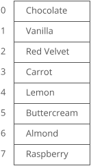
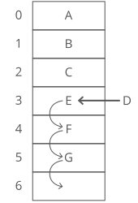
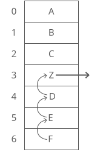

An array organizes items sequentially, one after another in memory.

Each position in the array has an **index**, starting at 0.

 _          |**Worst Case**
------------|:-------------
**space**   |$O(n)$
**lookup**  |$O(1)$
**append**  |$O(1)$
**insert**  |$O(n)$
**delete**  |$O(n)$

## Strengths:
* **Fast lookups.** Retrieving the element at a given index takes $O(1)$ time, regardless of the length of the array.
* **Fast appends.** Adding a new element at the end of the array takes $O(1)$ time.

## Weaknesses:
* **Fixed size.** You need to specify how many elements you're going to store in your array ahead of time. (Unless you're using a fancy dynamic array.)
* **Costly inserts and deletes.** You have to "scoot over" the other elements to fill in or close gaps, which takes worst-case $O(n)$ time.

## In Python
Some languages (including Python) don't have these bare-bones arrays.

Here's what arrays look like in Java.

```java
// instantiate an array that holds 10 integers
int gasPrices[] = new int[10];

gasPrices[0] = 346;
gasPrices[1] = 360;
gasPrices[2] = 354;
```

## Inserting
If we want to insert something into an array, first we have to make space by "scooting over" everything starting at the index we're inserting into:



In the worst case we're inserting into the 0th index in the array (prepending), so we have to "scoot over" everything in the array. That's $O(n)$ time.

## Deleting
Array elements are stored adjacent to each other. So when we remove an element, we have to fill in the gap—"scooting over" all the elements that were after it:



In the worst case we're deleting the 0th item in the array, so we have to "scoot over" everything else in the array. That's $O(n)$ time.

> Why not just leave the gap? Because the quick lookup power of arrays depends on everthing being sequential and uninterrupted. This lets us predict exactly how far from the start of the array the 138th or 9,203rd item is. If there are gaps, we can no longer predict exactly where each array item will be.

## Data structures built on arrays
Arrays are the building blocks for lots of other, more complex data structures.

**Don't want to specify the size of your array ahead of time? One option: use a dynamic array.**

**Want to look up items by something other than an index? Use a [dictionary](./dictionary.md).**
