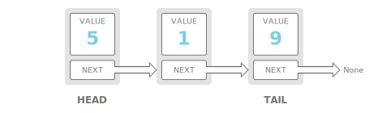
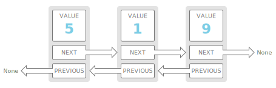

# Linked List

A **linked list** organizes items sequentially, with each item storing a pointer to the next one.

Picture a linked list like a chain of paperclips linked together. It's quick to add another paperclip to the top or bottom. It's even quick to insert one in the middle—just disconnect the chain at the middle link, add the new paperclip, then reconnect the other half.

An item in a linked list is called a **node**. The first node is called the **head**. The last node is called the **tail**.

> Confusingly, somtimes people use the word tail to refer to "the whole rest of the list after the head."



> Unlike an array, consecutive items in a linked list are not necessarily next to each other in memory.

## Strengths:
* **Fast operations on the ends.** Adding elements at either end of a linked list is $O(1)$. Removing the first element is also $O(1)$.
* **Flexible size.** There's no need to specify how many elements you're going to store ahead of time. You can keep adding elements as long as there's enough space on the machine.

## Weaknesses:
* **Costly lookups.** To access or edit an item in a linked list, you have to take $O(i)$ time to walk from the head of the list to the iith item.

## Uses:
**Stacks** and **queues** only need fast operations on the ends, so linked lists are ideal.

## In Python
Most languages (including Python) don't provide a linked list implementation. Assuming we've already implemented our own, here's how we'd construct the linked list above:

```python
a = LinkedListNode(5)
b = LinkedListNode(1)
c = LinkedListNode(9)

a.next = b
b.next = c
```

## Doubly Linked Lists

In a basic linked list, each item stores a single pointer to the next element.

In a **doubly linked list**, items have pointers to the next and the previous nodes.



Doubly linked lists allow us to traverse our list backwards. In a singly linked list, if you just had a pointer to a node in the middle of a list, there would be no way to know what nodes came before it. Not a problem in a doubly linked list.

## Not cache-friendly
Most computers have [caching systems that make reading from sequential addresses in memory faster than reading from scattered addresses](https://www.interviewcake.com/article/data-structures-coding-interview#ram).

**Array** items are always located right next to each other in computer memory, but linked list nodes can be scattered all over.

So iterating through a linked list is usually quite a bit slower than iterating through the items in an array, even though they're both theoretically $O(n)$ time.
